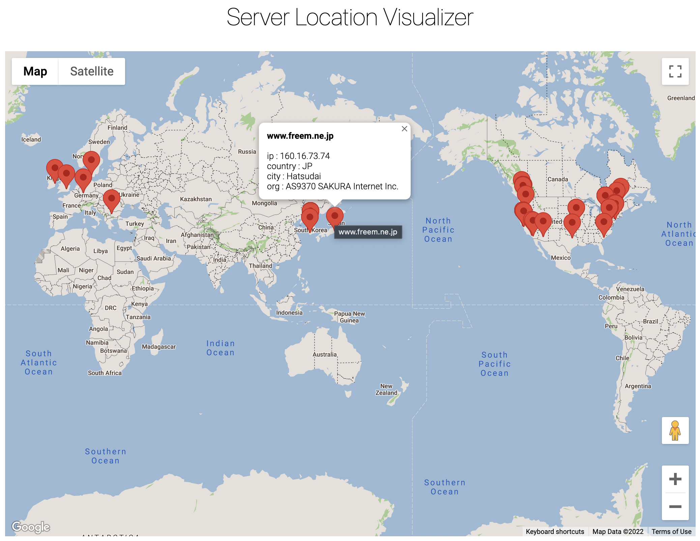

# Server-Location-Visualizer

This is a Server Location Visualizer project with python & javascript (Google Map API).

You can see the locations of the server that I've visited for a month and its detail in the map.

Try out the quick [Demo]('https://google.com") before the description.

This project is a implementation of this project idea. (https://practicalpython.yasoob.me/chapter9.html#)

---

## Data sourcing

You can export the history of your website you've visited from Chrome browser.(I used this [chrome extension](https://chrome.google.com/webstore/detail/export-chrome-history/dihloblpkeiddiaojbagoecedbfpifdj/related?hl=en) for export).

---

## API Info

You can use ipinfo (https://ipinfo.io) for converting domain names to IP detail

---

## Visualization

I used [Google Map APIs](https://developers.google.com/maps) for the marker and tooltips for this project.
